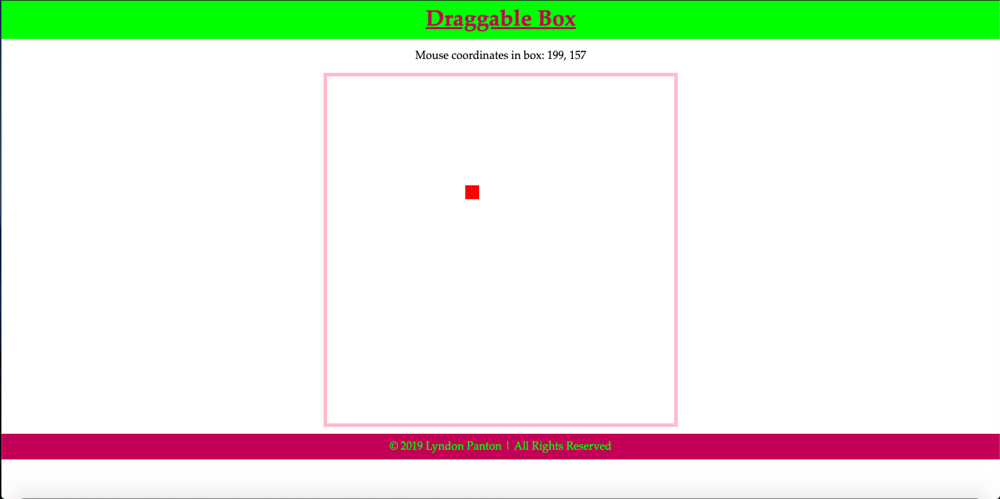
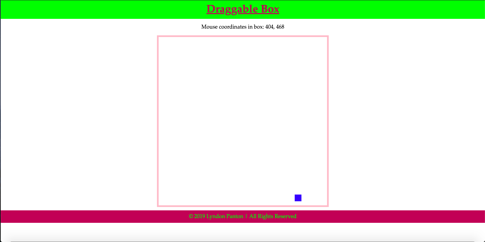

# Draggable Box

## How To Open
> 1. Go to the project's download folder
> 2. Right click on the file named _index.html_
> 3. Chose the _open with_ option
> 4. Open the project in the browser of your choice

## How To Use
> 1. Draggable your mouse in the canvas area to make the box follow it
> 2. Click down to make the box change colour

## Requirements
> 1. This project requires a browser to run
> 2. The browser must have JavaScript available and enabled

## Extra Info
> 1. This was an optional project for the w3c and Microsoft's *HTML5 Coding Essentials and Best Practices* course

## Preview

